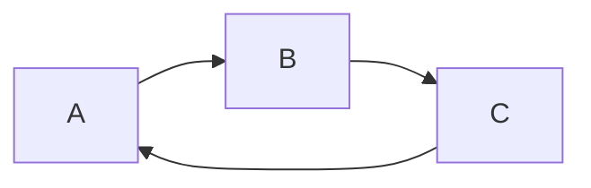
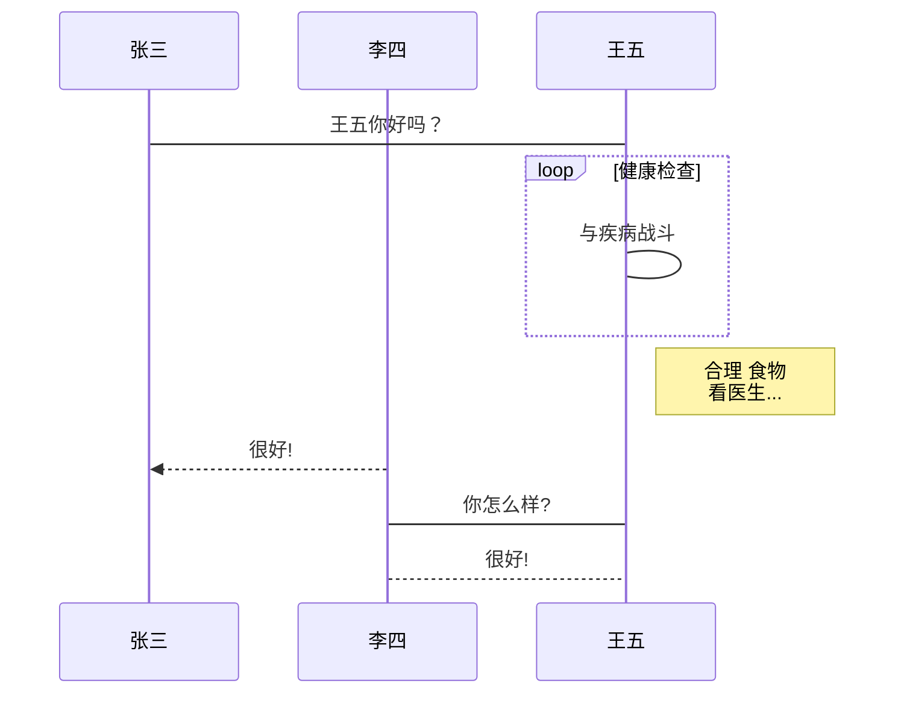
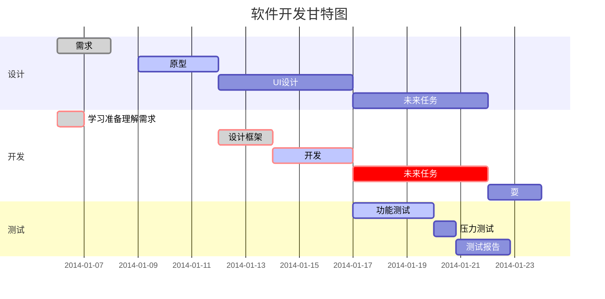

**目录**
<!-- @import "[TOC]" {cmd="toc" depthFrom=1 depthTo=6 orderedList=false} -->

<!-- code_chunk_output -->

- [简介](#简介)
- [相关文章](#相关文章)
- [目录](#目录)
- [引用](#引用)
- [分割线](#分割线)
- [超链接](#超链接)
- [强调](#强调)
- [删除线](#删除线)
- [注释](#注释)
- [表格](#表格)
- [task list](#task-list)
- [图像](#图像)
  - [标准流程图](#标准流程图)
  - [标准流程图横向](#标准流程图横向)
  - [UML 时序流程图](#uml-时序流程图)
  - [甘特图](#甘特图)
- [导入外部文件](#导入外部文件)
- [官方教程文档](#官方教程文档)

<!-- /code_chunk_output -->

## 简介
- 使用vscode中的插件：`Markdown Preview Enhanced`的预览功能

## 相关文章
1. <https://www.bookstack.cn/read/mpe/zh-cn-markdown-basics.md>

## 目录
- 可以通过 cmd-shift-p 然后选择 `Markdown Preview Enhanced: Create Toc `命令来创建 TOC。多个 TOCs 可以被创建。如果你想要在你的 TOC 中排除一个标题，请在你的标题 后面 添加 {ignore=true} 即可。

## 引用
>引用内容  
>应用内容  
>> 引用内容  

## 分割线

***
---
___

* * *
- - -

## 超链接

- [文本](link)
- 自动链接:<https://www.baidu.com/>


## 强调
- 这是用来 *演示* 的 _文本_
这是用来 **演示** 的 __文本__

## 删除线
这就是 ~~删除线~~

## 注释
[//]: 注释
[^_^]: (注释不会显示)

## 表格
| left | center | right |
| :--- | :----: | ----: |
| aaaa | bbbbbb | ccccc |
| a    | b      | c     |

## task list
- [ ] Eat
- [x] Code
  - [x] HTML
  - [x] CSS
  - [x] JavaScript
- [ ] Sleep

## 图像

```sequence {theme="hand"}
Andrew->China:Says Hello
Note right of China:China thinks\nabout it
China-->Andrew:How are you?
Andrew->>China:I am good thanks!
```


### 标准流程图

```flow
st=>start: 开始框
op=>operation: 处理框
cond=>condition: 判断框(是或否?)
sub1=>subroutine: 子流程
io=>inputoutput: 输入输出框
e=>end: 结束框
st->op->cond
cond(yes)->io->e
cond(no)->sub1(right)->op
```

### 标准流程图横向

```flow
st=>start: 开始框
op=>operation: 处理框
cond=>condition: 判断框(是或否?)
sub1=>subroutine: 子流程
io=>inputoutput: 输入输出框
e=>end: 结束框
st(right)->op(right)->cond
cond(yes)->io(bottom)->e
cond(no)->sub1(right)->op
```

### UML 时序流程图 
```sequence
Title: 标题：复杂使用
对象A->对象B: 对象B你好吗?（请求）
Note right of 对象B: 对象B的描述
Note left of 对象A: 对象A的描述(提示)
对象B-->对象A: 我很好(响应)
对象B->小Q: 你好吗
小Q-->>对象A: 对象B找我了
对象A->对象B: 你真的好吗？
Note over 小Q,对象B: 我们是朋友
participant C
Note right of C: 没人陪我玩
```


### 甘特图


## 导入外部文件
`@import "你的文件"`

## 官方教程文档
- [官方文档](https://markdown.com.cn/basic-syntax/)

